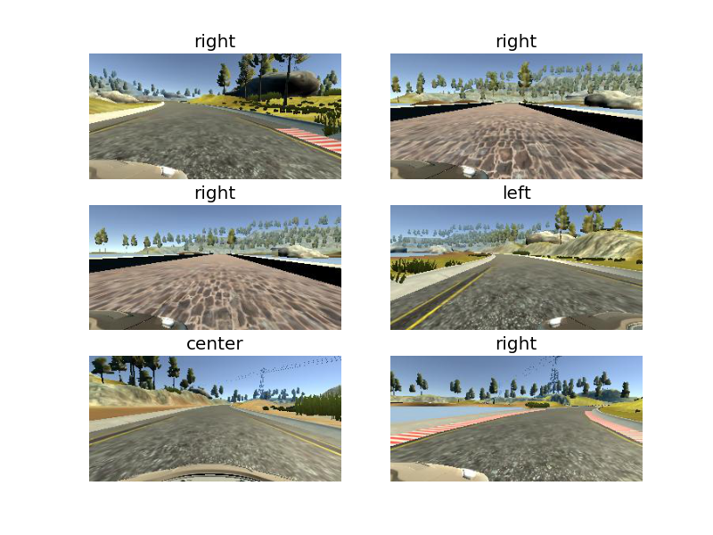
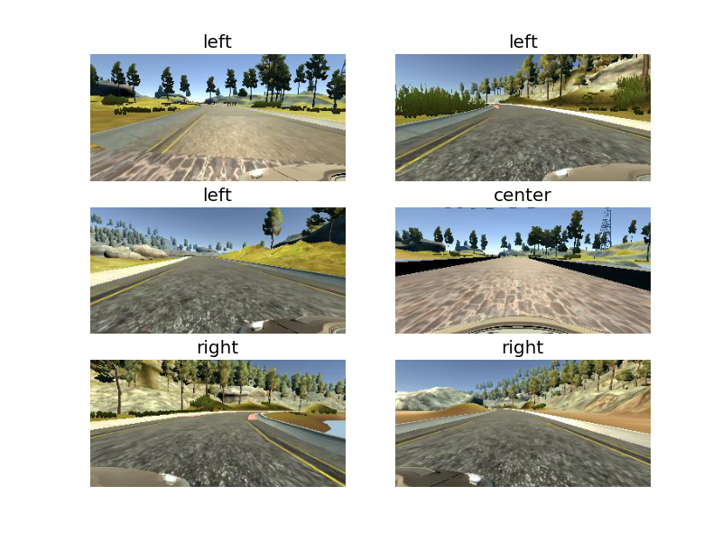

# CarND Project 3 - Behavioural Cloning

## Introduction

The code in this repository aims at implementing a Convolutional Neural Network - CNN to let a car driving autonomously in a game simulator.

The folder is hereby organized:

  - `drive.py`: python script to autonomously drive the car in the simulator.
  - `model.py`: python script to train the Convolutional Neural Network model.
  - `model.h5`: model weights file.
  - `model.json`: model network file. Saved using `json.dump(model.to_json(), f)` Keras API.

## Approach

The model architecture used in this project is the one proposed by NVIDIA in the **End to End Learning for Self-Driving Cars** white paper ([link](https://images.nvidia.com/content/tegra/automotive/images/2016/solutions/pdf/end-to-end-dl-using-px.pdf)). Such architecture has been proven to produce a really accurated result in predicting steering angles from camera images. At this stage, no other model architectures were choosen besides the NVIDIA one which, as shown below, provides a relly nice result.

## Model Architecture

The model is composed of 3 macro blocks and takes as input a 3-colors image, 66 pixels in height and 200 pixels wide. The first block consists in a simple normalization layer which maps the image pixel values in the [-0.5, +0.5] interval. The second block is made of 5 convolutional layers. Between each of the convolutional layers is placed an **Exponential Linear Units - ELU** function. The reason of choosing an ELU function instead of a simple ReLU lies in the fact the the ELU provides a *smoother transition between steering angles* [[reference](https://chatbotslife.com/using-augmentation-to-mimic-human-driving-496b569760a9#.xkwp51624#modelarchitectureandtraining)]. The third and last block is made of 4 fully-connected layers which flow into a single neuron layer that outputs the predicted steering angle. In the last block of the network and more precisely, between any two fully connected layers a dropout layer has been used. The dropout layers allow the network to avoid overfitting.

The table below depicts the complete Network Architecture together with the count of the training parameters.

| Layer (type)  | Output Shape       | Param #
|:-------------:|:------------------:|:----------:|
| Normalization | (None, 66, 200, 3) | -
| Convolution2D | (None, 31, 98, 24) | 1824 
| ELU           | (None, 31, 98, 24) | -
| Convolution2D | (None, 14, 47, 36) | 21636  
| ELU           | (None, 14, 47, 36) | -
| Convolution2D | (None, 5, 22, 48)  | 43248
| ELU           | (None, 5, 22, 48)  | -
| Convolution2D | (None, 3, 20, 64)  | 27712
| ELU           | (None, 3, 20, 64)  | -
| Convolution2D | (None, 1, 18, 64)  | 36928
| Flatten       | (None, 1152)       | -
| Dropout       | (None, 1152)       | - 
| ELU           | (None, 1152)       | -           
| Dense         | (None, 100)        | 115300                     
| Dropout       | (None, 100)        | -                      
| ELU           | (None, 100)        | -               
| Dense         | (None, 50)         | 5050                    
| Dropout       | (None, 50)         | -                      
| ELU           | (None, 50)         | -                    
| Dense         | (None, 10)         | 510                  
| Dropout       | (None, 10)         | -                          
| ELU           | (None, 10)         | -          
| Dense         | (None, 1)          | 11        

The complete network consists of more than 250k trainable parameters.

## Training

The model was trained in two steps over two different datasets. A first training session was conducted using the **Udacity dataset** which is a collection of more than 8000 sets of pictures, each set consisting in a central, left and right image taken from image cameras. In this first training session a standard value for the **learning rate** was used: 0.001.

The second training session was conducted on a set of data generated by myself using the Udacity simulator in *training mode* at a lower learning rate than the first training session (0.0001). More precisely, I personally driven the car in the simulator by waving from the outside of the lane toward the inside in such a way to *teach* the network to recovery the car in case it is driving outside the road.

Both the training sessions use image augmentation by shifting the input images horizzontally and modifying the steering angle by a delta mapped to be 0.25 degrees for each pixel of shift. In addition, randomly, some images are flipped on the vertical axis and the corresponding steering angle is changed in sign. Finally, to train the model I exploited a really interesting feature of Keras, that is the `fit_generator` function.

Both the training sessions use a `batch_size` of 64 elements. Because of the enormous size of the dataset, it is not possible to load all the input data in memory, for this reason, only a small part of the entire dataset (64 samples) were loaded, augmented and later used for training the model. In this particular scenario, higher values of the `batch_size` parameter
do not lead to better results in terms of accuracy, instead, they speed up a little the training procedure.

The `epochs` parameter was probably the most important parameter to tune in both the training sessions. As can be seen in `model.py`, the value choosen in the project is 5. Higher values do not lead to higher accuracy of the model, instead, they usually cause the model to overfit and not to generalize its behaviour. Practically, I did try to train the model using 10 epochs and I noticed that for the first 5/6 epochs the loss function was decreasing whereas for the remaining 5/4 epochs the loss was either stay still or, even worse, it was increasing its value.

## Dataset exploration

This section provides an exploration of the datasets used to train the model.

The **first** set of images are taken from the **Udacity Dataset** and depict the car driving on a straight line. The only exception is the bottom right image which depicts the car in a corner heading to the right. For each image, the dataset maps a steering angle therefore, in the model, the car is taught to predict steeting angle given what it is able to perceive though its cameras.

Moreover, the images depicted below are entitled with the following keywords: `center`, `right` and `left`. That means, images were taken from the center camera mounted on the car hood, left/right cameras mounted on the car left/right rear-view mirror.

The **second** set of images are taken from **my Dataset** whose is a collection of images and steering angles in those cases where the car is recovering its position from driving outside the lane lines.

## Results

The trained model is able to drive autonomously *for ever* on the track #1 without going outside the road. The model is developed in such a way to automatically adapt on different screen resolutions. The model was trained on the lowest resolution (640x480) and validated on the middle (800x600) and highest (1024x768). In addition, the model, as is, is able to drive on the track #2 until the first steep hill, after reaching the first hill, the car starts slowing down until it stops because of the reduced throttle.

I would like to point out that the entire model was trained **only** on track #1.

## Future Works

The first improvement on this project will be making the car driving autonomously on track #2 using training images only from track #1. For this to happed I will take inspiration from [Vivek post on Medium](https://chatbotslife.com/using-augmentation-to-mimic-human-driving-496b569760a9#.xgogkzi06).

*Stefano*
